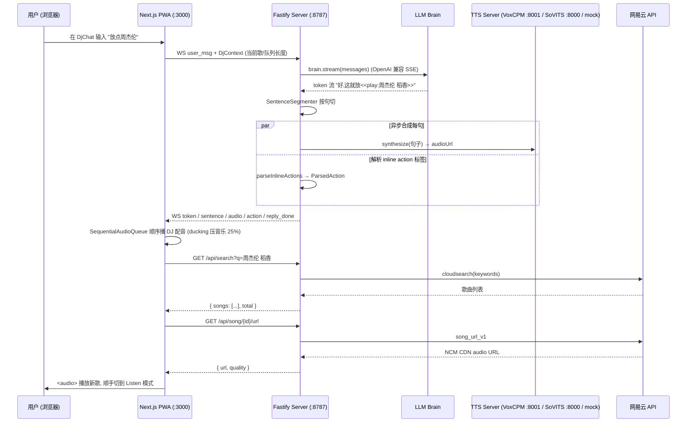

# 00 · 总览

## 一句话定义

**Deepulse** = 个人 AI 电台 PWA. 浏览器开 `localhost:3000`, **LLM 当 DJ 大脑**给你说话+选歌, **网易云** API 提供音源 + 元数据, **流式 TTS** 把 DJ 的串场词变成声音, 在浏览器里用 `<audio>` + Web Audio API 播放.

## 顶层数据流 (一次"用户输入 → DJ 回话 → 切歌"完整回合)



## 仓库布局

```
d:/AI music radio/
├── apps/
│   ├── pwa/                 Next.js 15 + React 19 + Tailwind 4 — 浏览器界面
│   └── server/              Fastify 5 + @fastify/websocket — 后端
├── packages/
│   ├── domain/              核心业务类型 + Errors (零外部依赖)
│   ├── application/         Ports (接口) + Use cases + DJ persona prompt
│   ├── infrastructure/      Ports 的具体实现 (brain/tts/ncm/db/...)
│   └── shared/              env config / dj-ws WS 协议 / logger
├── tools/
│   ├── arch-test/           架构依赖测试 (检查 Clean Arch 没破)
│   ├── configs/             共享 eslint/tsconfig
│   ├── voxcpm-server/       Python FastAPI wrapper 调 VoxCPM2 模型
│   ├── blender/             场景图原料 (.blend 文件)
│   └── blender-mcp-main/    Blender MCP server (建模时调)
├── deepulse.bat              Windows 双击启动 (起 PWA + Server + 可选 vox)
├── pnpm-workspace.yaml      pnpm workspace 配 (apps/* + packages/* + 两个 tools)
└── package.json             root, 用 turbo 跑 dev/build/test/lint/typecheck
```

详见各包笔记:

- [[02 domain 包]]
- [[03 application 包]]
- [[04 shared 包]]
- [[05 infrastructure 包]]
- [[06 apps-server]]
- [[07 apps-pwa]]

## 关键技术栈 (按层)

| 层            | 技术                                                                   | 来源                                           |
| ------------- | ---------------------------------------------------------------------- | ---------------------------------------------- |
| 前端          | Next.js 15, React 19, Tailwind 4                                       | `pnpm-workspace.yaml` catalog                  |
| 后端          | Fastify 5, @fastify/websocket, @fastify/cors, pino                     | 同上                                           |
| 协议          | zod (单一真相源 schema + 类型推导)                                     | 同上                                           |
| DB            | better-sqlite3 + drizzle-orm (同步 API, 单用户够用)                    | 同上                                           |
| Brain (LLM)   | OpenAI 兼容 SSE (deepseek/ollama/openai/任意) 或 claude CLI 子进程     | `infrastructure/brain/`                        |
| TTS           | VoxCPM2 (推荐) / GPT-SoVITS / mock (静音 wav)                          | `infrastructure/tts/`                          |
| 短期记忆      | Redis (ioredis) 优先, 内存 fallback                                    | `infrastructure/short-term-memory/`            |
| 长期记忆      | markdown 文件 (`apps/server/data/dj-long-term.md`)                     | `infrastructure/long-term-memory/`             |
| 网易云        | Binaryify/NeteaseCloudMusicApi (作为 Node 库, 非子进程)                | `infrastructure/ncm/`                          |
| HTTP 客户端   | undici (server 端, 调 TTS) / 浏览器 fetch (前端)                       | 直接用                                         |
| 进程子进程    | execa (调 claude CLI)                                                  | `brain/claude`                                 |
| Browser Audio | `<audio>` element + Web Audio API (AudioContext + GainNode 做 ducking) | `apps/pwa/components/player/sharedAudioCtx.ts` |
| 包管理        | pnpm 11 (`engines.pnpm >=11`), Node 22.13+ (`engines.node >=22.13`)    | `package.json:8-11`                            |
| 任务跑        | turbo (`pnpm dev` 并行起 PWA + Server)                                 | `package.json:13`                              |

## 默认配置 ("装好直接能用"的部分)

| 项               | 默认                                              | 来源                                     |
| ---------------- | ------------------------------------------------- | ---------------------------------------- |
| BRAIN_TYPE       | `openai-compat` (但 URL 必须显式 set, 不预填)     | `shared/config/index.ts:56-58`           |
| TTS_TYPE         | `mock` (1 秒静音 wav, 没声音但 UI 完整)           | `shared/config/index.ts:46`              |
| SERVER_PORT      | 8787                                              | 同上                                     |
| PWA_PORT         | 3000                                              | 同上                                     |
| DATABASE_URL     | `./data/deepulse.db`                              | 同上                                     |
| 默认音量         | 0.04 (4%, 用户原话"100 震聋了")                   | `apps/pwa/components/player/types.ts:39` |
| Session 闲置 TTL | 30 分钟 (再发消息算新 session, 自动 distill 旧的) | `shared/config/index.ts:32`              |

## 单用户应用的简化

这套架构有意识地**没做**多租户:

- 网易云只存一个 cookie (`ncm_account.id=1` 单行表)
- snapshot 只存一份 (`ncm_snapshot.id=1` 单行表)
- DJ 长期记忆只一个文件 (`dj-long-term.md`)
- Redis key 也没分 user (`deepulse:mem:active` / `deepulse:mem:session` 全局两个 key)

意识到这点对加新功能很重要: 别为想象中的"多用户"额外加 user_id 字段或前缀, 没有这个需求.
