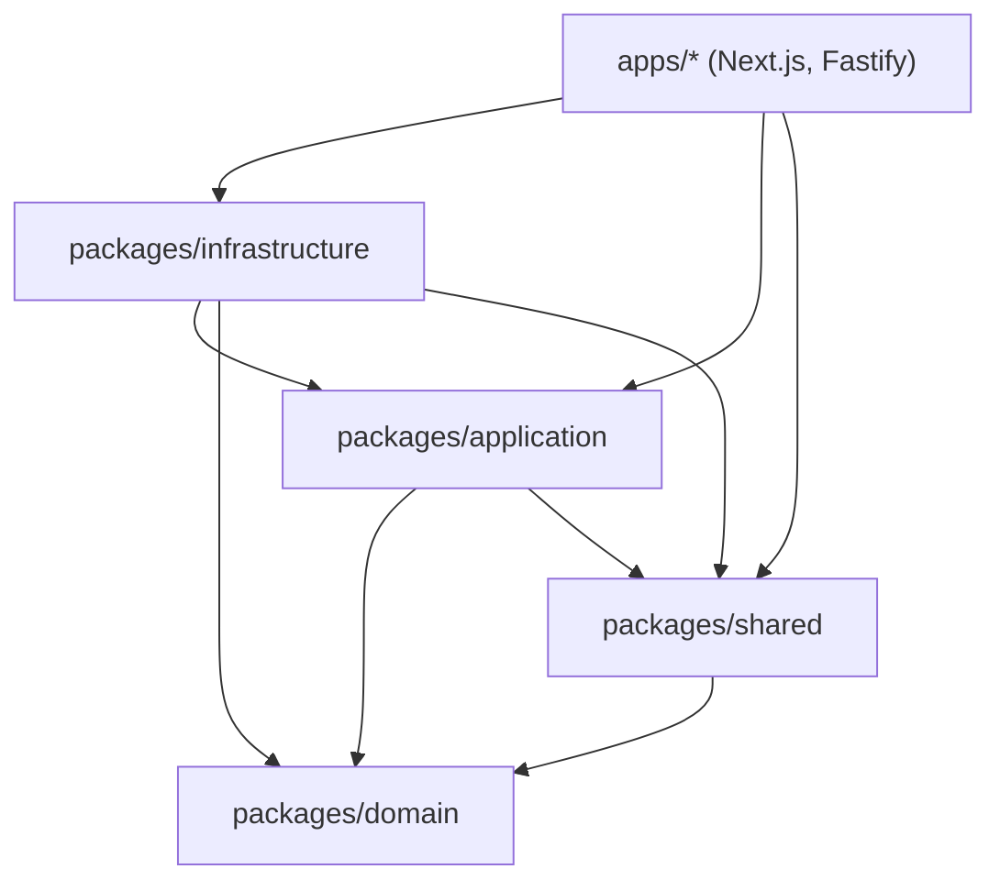

# 01 · Clean Architecture 分层

## 总原则: 单向依赖, 内层不知道外层存在

**关键不变量**:

- `domain` **零外部依赖** (TypeScript 标准库不算). 不引 zod / pino / fastify / drizzle / undici.
- `application` 只引 `domain` 和 `shared`. **永远不引 infrastructure** — port 接口定在 application, infrastructure 实现这些 port, 不能反过来 (依赖倒置).
- `infrastructure` 引 `application` (拿 port 接口 + DTO 类型) + `domain` (业务实体). 但 **不引 apps**.
- `apps` 是叶子, 任何包都可以引.

这套约束有 `tools/arch-test` 跑 dependency-cruiser 强制 (脚本: 根 `package.json:19` 的 `arch:check`).

## 各层职责

### `packages/domain` (最内层)

只定义"业务存在什么"的纯类型 + 业务异常类:

- 实体: `Song` / `Artist` / `Album` / `Bubble` (DJ 串场) / `Plan` + `PlanItem` (节目单) / `MoodContext` / `TasteDocument` + `MoodRule` + `Routine`
- Branded ID: `SongId` / `ArtistId` / `AlbumId` / `PlanId` / `BubbleId` / `UserId` / `PlaylistId` (防 string 串台)
- 错误类: `DomainError` → `NotFoundError` / `ValidationError` / `ExternalServiceError`

详见 [[02 domain 包]].

文件: `packages/domain/src/{index,song,bubble,plan,mood,taste,ids,errors}.ts`

### `packages/application` (内层 #2)

业务**逻辑**, 不知道 IO 怎么发生:

- **Ports** (端口接口): `IBrain` (LLM) / `ITtsClient` / `INcmClient` / `IClock` / `IShortTermMemoryRepo` / `ILongTermMemoryRepo` / `ISongRepo` / `IPlaysRepo` / `INcmAccountRepo` / `INcmSnapshotRepo` / `IConversationsRepo` / `IUserPrefsRepo`
- **Use cases**: 每个用例编排几个 port 完成一件事, 不出现 fetch/fs/exec
  - `runDjTurn` — 一次 DJ 对话回合 (流式)
  - `distillSession` — session 结束时 distill 短期记忆 → 长期
  - `generateSubtitle` — 切歌时让 brain 出一句字幕
  - `completeQrLogin` — 扫码成功后的 cookie + snapshot 编排
  - `refreshUserSnapshot` — 手动刷快照
- **DJ 模块** (`dj/`): persona prompt 装配 + 流式 token 句切器 + DjContext 类型

详见 [[03 application 包]].

### `packages/shared`

跨层共享的**纯 schema + 配置 + 日志**, 不含业务:

- `config/index.ts` — env 校验 (zod), `loadEnv()` 返 `Env` 类型
- `dj-ws/protocol.ts` — WS 消息 zod schema + `parseInlineActions` (从 DJ 文本剥 `<<play:...>>` 标签)
- `logger/index.ts` — pino 包装, redact 敏感字段 (cookie/token/password)

详见 [[04 shared 包]].

### `packages/infrastructure` (外层 #1)

实现 application 的 ports, 真正干 IO:

- `brain/` — `claude` 子目录 (execa 调 claude CLI) + `openai-compat` 子目录 (fetch SSE)
- `tts/` — `voxcpm` / `gpt-sovits` / `mock` 三个子目录
- `ncm/` — `NcmClient` 包装 NeteaseCloudMusicApi npm 库
- `db/` — drizzle schema + 5 个 repo 工厂 (`createSongRepo` 等)
- `short-term-memory/` — Redis 优先, 内存 fallback
- `long-term-memory/` — markdown 文件 append
- `user-prefs/` — 用户手写 markdown 文件读 (TTL 过期过滤)
- `clock/` — `createSystemClock` 返 `IClock`

**关键约束**: 兄弟 adapter 不互相 import — 比如 `brain/` 不能 import `tts/`. 跨 adapter 协作走 composition root 编排.

详见 [[05 infrastructure 包]].

### `apps/` (叶子)

- `apps/server/src/composition.ts` — 把 env → adapter 工厂 → Container, 所有"具体实现绑定"集中在这一个文件
- `apps/server/src/api/*.ts` — Fastify 路由, **薄包装**: parse 请求 → 调 use case 或直接调 NcmClient → 返 JSON
- `apps/pwa/app/page.tsx` — Next.js 入口, 一行 `<Player />`
- `apps/pwa/app/components/*` — React 组件 + hook

详见 [[06 apps-server]] 和 [[07 apps-pwa]].

## 为什么要分这么细 (设计意图)

代码注释里反复出现的这套约束是 architect audit 留下的 (`packages/application/src/use-cases/dj/run-dj-turn.ts:7-9`):

> 解耦点 (architect audit CRITICAL fix):
>
> - WS framing 留在 apps/server/src/api/dj-ws.ts (只 send 到 socket)
> - 业务编排 (Brain + segmenter + dispatcher + actions + persist) 来这里
> - 依赖全走 ports, 测试可注入 fake

这套结构换 IO 实现 (DeepSeek → Ollama, VoxCPM → SoVITS, SQLite → PostgreSQL) 只动 composition + 对应 adapter, 不动 use case + domain + 路由层.

## 加新 adapter 的模板

要加一种新的 brain / tts / ncm 之外的 port (比如新加一种"图片 OCR"):

1. **port**: 在 `packages/application/src/ports/` 新建文件, 定义 `IFooClient` interface, 在 `ports/index.ts` re-export
2. **adapter**: 在 `packages/infrastructure/src/foo/` 新建子目录, 写 `class XxxFooClient implements IFooClient`, 在 `infrastructure/src/foo/index.ts` 导出工厂 `createFoo`
3. **composition**: 在 `apps/server/src/composition.ts` 的 `Container` 类型 + `buildContainer` 函数加上 `foo: IFooClient`
4. **路由**: 在 `apps/server/src/api/` 新建 plugin, 通过 `container.foo` 调

不要在 fastify handler 里 `new XxxFooClient(...)` — 那破了依赖方向, dependency-cruiser 会 fail.
