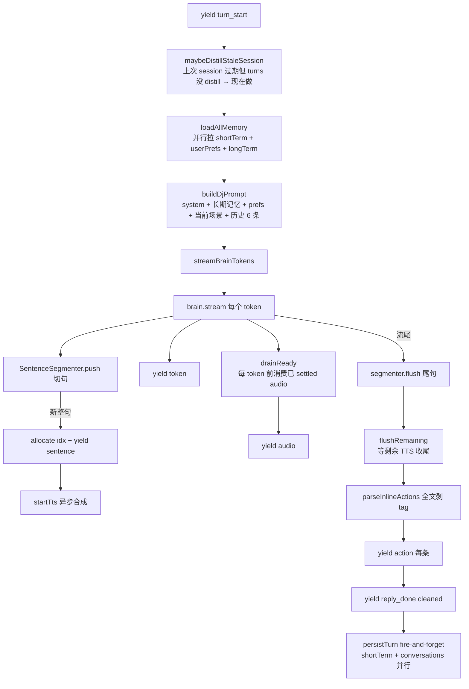

# 03 · application 包

> 业务**逻辑**层. 定义 ports (端口接口) + use cases (用例编排) + DJ 子模块 (persona prompt + 句切器).
> 入口: `packages/application/src/index.ts` re-export `ports/`, `use-cases/`, `dj/`.

## Ports (端口接口) (`packages/application/src/ports/`)

Application 层定义**应用需要什么**, 但不知道**怎么实现**. infrastructure 实现这些 port — 这是 Clean Arch 的依赖倒置.

### `IBrain` (`ports/brain.ts`)

LLM 抽象:

```ts
type BrainMessage = { readonly role: 'system' | 'user' | 'assistant'; readonly content: string }
type BrainGenerateOptions = {
  readonly signal?: AbortSignal
  readonly maxTokens?: number
  readonly temperature?: number
}

interface IBrain {
  // 流式吐 token (DJ 对话)
  stream(messages, options?): AsyncIterable<string>
  // JSON 模式 (选歌 plan / distill 摘要 / 字幕)
  generateJson<T>(messages, schema: z.ZodSchema<T>, options?): Promise<T>
}
```

实现: 见 [[05 infrastructure 包]] 的 brain 节.

### `ITtsClient` (`ports/tts.ts`)

```ts
const TTS_EMOTIONS = ['中立', '开心'] as const // 只做正面+中性, 不做负面
type TtsEmotion = (typeof TTS_EMOTIONS)[number]

interface ITtsClient {
  synthesize(req: { text; emotion }): Promise<{ audioUrl: string }>
}
```

注意元组在前 / 类型从元组推 — 让 zod.enum + array.includes 这种运行时校验和编译期类型走同一真相源.

### `INcmClient` (`ports/ncm.ts`)

最大的 port. 含全部 NCM 操作:

- 搜索: `search` / `searchSuggest`
- 播放: `getSongUrl(songId, quality)` / `getLyric`
- 推荐: `dailyRecommendations` / `privateFm` / `heartMode` / `toplist`
- 用户库: `fetchUserSnapshot` / `getMyPlaylists` / `getPlaylistTracks`
- 互动: `like` / `fmTrash`
- 登录: `qrCreate` / `qrCheck`
- Cookie 管理 (本地状态, 不 IO): `setCookie` / `clearCookie` / `getCookie`

返回类型 (`NcmUserSnapshot` / `NcmPlaylistMeta` / `NcmLyric` 等) 也在这个文件里定义, 是跨包共享 DTO.

### `IClock` (`ports/clock.ts`)

```ts
interface IClock {
  nowMs(): number
}
```

**为什么**: use case / repo / NcmClient 拿"现在"全走 IClock, 不直接 `Date.now()`. 让单测能注入 FakeClock 控制时间分支 (TTL / 时间戳生成 / 延迟统计).

注: 不是所有地方都贯彻了 — 比如 `infrastructure/db/repos/account-repo.ts:17` 直接 `Date.now()`. 这是 known gap.

### 记忆 (`ports/memory.ts`)

```ts
type SessionTurn = { tsMs; userMsg; djReply }

interface IShortTermMemoryRepo {
  appendTurn(turn): Promise<void> // 顺手刷 session TTL
  loadCurrentSession(): Promise<readonly SessionTurn[]>
  isSessionActive(): Promise<boolean>
  clearSession(): Promise<void> // distill 完调
  endSession(): Promise<void> // 用户手动结束 — 立即过期
}

type LongTermEntry = { tsMs; summary } // distill 出的 1-2 句中文

interface ILongTermMemoryRepo {
  load(): Promise<readonly LongTermEntry[]>
  append(entry): Promise<void>
}
```

**设计意图** (注释里, `ports/memory.ts:1-7`):

- 短期 = Redis 热缓存, **session 边界 = 闲置 TTL 过期** → 下次回来 DJ 不接几天前话头
- 长期 = 文件 (markdown 一行一条), session 结束 distill 写入. "上次没聊完的话头"不进长期, 那是短期专用

### 仓储 (`ports/repos.ts`)

```ts
interface ISongRepo {
  findById
  upsert
}
interface IPlaysRepo {
  recordPlay
  recentPlays
  countPlays
}
interface INcmAccountRepo {
  saveCookie
  loadCookie
  clear
}
interface INcmSnapshotRepo {
  save
  load
  status
}
interface IConversationsRepo {
  append
} // append-only 归档, 不进 prompt
interface IUserPrefsRepo {
  load(nowMs): Promise<{ longTerm; shortTerm }>
}
```

`IConversationsRepo` 当前只 append, 不查 — 历史走 short-term Redis 进 prompt, 这表只是 SQLite 长期审计/分析用途 (`run-dj-turn.ts:60-61` 注释).

## Use cases (`packages/application/src/use-cases/`)

`use-cases/index.ts` 列了所有:

```ts
export const USE_CASES_VERSION = 'm3-1' as const
export * from './dj/run-dj-turn.js'
export * from './dj/distill-session.js'
export * from './dj/generate-subtitle.js'
export * from './login/complete-qr-login.js'
export * from './snapshot/refresh-user-snapshot.js'
```

### `runDjTurn` — DJ 对话主流程 (`use-cases/dj/run-dj-turn.ts`)

**最复杂的 use case**. 把"用户发一条 → DJ 流式回复 → 同步 TTS → 解析 action → 写入持久"全编排成 `AsyncGenerator<DjTurnEvent>`.

输入:

```ts
type RunDjTurnDeps = {
  readonly brain
  tts
  shortTerm
  longTerm
  conversations
  userPrefs
  clock
  readonly log?: UseCaseLogger
}
type RunDjTurnInput = { turnId; userText; signal; context? }
```

输出事件:

```ts
type DjTurnEvent =
  | { type: 'turn_start'; turnId: string }
  | { type: 'token'; text: string }
  | { type: 'sentence'; idx: number; text: string }
  | { type: 'audio'; sentenceIdx: number; url: string }
  | { type: 'action'; action: ParsedAction }
  | { type: 'reply_done'; fullReply: string }
  | { type: 'error'; msg: string }
```

#### 流程 (run-dj-turn.ts:74-119)



#### 关键设计点

1. **session 边界 distill** (`run-dj-turn.ts:148-167`): 进 turn 前, 如果 `isSessionActive=false` 且 `loadCurrentSession()` 非空 → 上次 session 已过期但没消化 → **同步**等 `distillSession` 完, 让本轮 prompt 拿到刚写入的长期记忆.

2. **流式 TTS 真交叉** (`PendingAudioQueue` 类, `run-dj-turn.ts:247-296`): 不是等 brain 流完才合成所有句. 每个 token 前 `drainReady()` 同步消费已 settled 的 audio event — 让"brain 还在吐 token, 已合成句子已经能播了"成真. 旧实现是 `drainReady` 空 generator, 所有 audio 堆到 `flushRemaining` 一次性给, 流式 TTS 退化成批处理.

3. **abort 双重 check** (`run-dj-turn.ts:97-113`): `streamBrainTokens` 内部 detect 到 abort 是悄悄 return 不抛, 外层 for-await 只看到流提前结束 — 必须再查一次 signal, 否则会把"被打断的半句"当正常完成 yield `reply_done`.

4. **失败语义** (注释 `run-dj-turn.ts:10-13`):
   - Brain 失败 / abort → yield `error` 事件后停 (不抛, 让调用方 graceful)
   - TTS 失败 → 单句静默, 整轮不影响
   - persist 失败 → log warn, 整轮不影响

### `distillSession` (`use-cases/dj/distill-session.ts`)

把当前 session 的 turn 流喂给 brain.generateJson, 让它判断有没有"值得长期记的", 有就 append 到 long-term, 然后 `clearSession`.

返回 `{ ok: true, summary }` 或 `{ ok: false, reason }`. 失败时**不 clear** — 下次再试 (避免丢).

prompt 在 `dj/prompt.ts:84-90` 的 `DISTILL_SYSTEM`, 强调"不要把没聊完的话头当值得记的".

### `generateSubtitle` (`use-cases/dj/generate-subtitle.ts`)

切歌字幕. 输入 `{currentSong, previousSong?, userInitiated}`, 输出 `{text: string|null}`. 失败返 null, 调用方 fallback 本地模板 (见 [[07 apps-pwa]] 的 useDjCloud).

`SUBTITLE_SYSTEM` prompt 在 `dj/prompt.ts:102-115`. 要求: 1 句 ≤ 30 字, 中文, 深夜电台口吻.

### `completeQrLogin` (`use-cases/login/complete-qr-login.ts`)

扫码成功后:

1. `ncm.setCookie(cookie)` — 内存设, 永远先做 (本次会话立即可用)
2. 如果 `persist=true` → `account.saveCookie(cookie)` — 失败 log warn 不抛
3. 后台 `ncm.fetchUserSnapshot()` → `snapshot.save(snap)` — fire-and-forget, 不阻塞返回

### `refreshUserSnapshot` (`use-cases/snapshot/refresh-user-snapshot.ts`)

最薄的 use case (8 行):

```ts
const snap = await deps.ncm.fetchUserSnapshot()
await deps.snapshot.save(snap)
return { ok: true, snapshot: snap }
```

之前在 `api/snapshot.ts` 路由里直接编排, 现在抽到 use case 让路由层更干净.

## DJ 子模块 (`packages/application/src/dj/`)

### `prompt.ts` — DJ persona 装配

三个 prompt builder:

#### `buildDjPrompt(args)` — chat prompt (主流程用)

System 段分顺序 (`prompt.ts:62-72`):

```
1. PERSONA (永远在)
2. # 你已经认得的这位听众 (长期记忆, 有则放)
3. # 这位听众的喜好 (prefs, 有则放)
4. # 当下场景 (current song + queue len + recently skipped + weather)
```

然后历史最近 6 条 (`SESSION_HISTORY_LIMIT`) 拼成 user/assistant 交替, 最后用户当前消息.

#### `buildDistillPrompt(turns)` — distill 用

System 强调"挑值得记的, 别把没聊完话头当值得记". 输出 JSON `{summary, worthKeeping}`.

#### `buildSubtitlePrompt(args)` — 字幕用

强调一句 ≤ 30 字 + 深夜电台口吻 + userInitiated 区分语气 (用户主动点的歌 vs 自动续播).

### `sentence-segmenter.ts` — 流式 token 句切器

```ts
class SentenceSegmenter {
  push(token): readonly string[] // 返这 chunk 后新完成的整句
  flush(): string // 流尾返不完整尾巴
}
```

切分用正则 `/[。？！?!；;\n]/`. 累积到 `buf`, 每来一 chunk 找所有句末标点位置 split.

测试见 `sentence-segmenter.test.ts`.

### `types.ts` — DjContext type-only re-export

```ts
export type { DjContext } from '@deepulse/shared/dj-ws'
```

**为什么 re-export 而不让业务直接引 shared**: shared 是 transport 层 (wire format / zod / logger), 业务概念 (DjContext) 落它里是"概念循环依赖". 这一行 re-export 把 canonical home 拉回 application — 业务代码引 `@deepulse/application` 拿 `DjContext`, schema 定义留在 shared. 注释见 `dj/types.ts:1-10`.

返回 [[01 Clean Architecture 分层]]. 接下来看 [[04 shared 包]].
