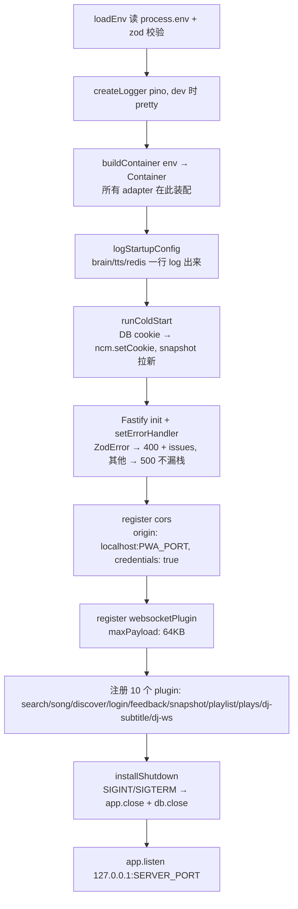
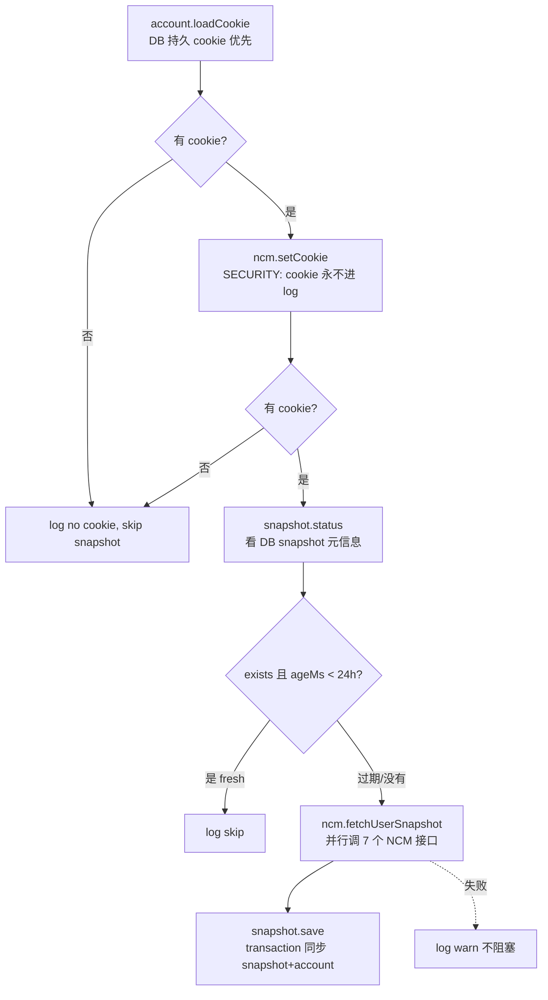

# 06 · apps/server

> Fastify 5 + @fastify/websocket. 入口 `apps/server/src/index.ts`, composition root 在 `apps/server/src/composition.ts`.

## 启动流程 (`apps/server/src/index.ts`)



`logStartupConfig` (`index.ts:34-52`) 把 brain/tts/db/redis 选了啥一行 log 出 — 排查"fetch failed"/"没声音"时一眼看到选了啥实现, key 只打前 8 位防泄漏.

## Container (`apps/server/src/composition.ts`)

```ts
type Container = {
  readonly env: Env
  readonly brain: IBrain
  readonly tts: ITtsClient
  readonly ncm: INcmClient
  readonly db: DbClient
  readonly clock: IClock
  readonly songs: ISongRepo
  readonly plays: IPlaysRepo
  readonly snapshot: INcmSnapshotRepo
  readonly account: INcmAccountRepo
  readonly conversations: IConversationsRepo
  readonly userPrefs: IUserPrefsRepo
  readonly shortTerm: IShortTermMemoryRepo
  readonly longTerm: ILongTermMemoryRepo
}
```

`buildContainer(env)` 把所有具体实现绑给 port. 换实现 = 改这里一处.

**路径常量** (`composition.ts:62-68`):

```ts
const currentDir = dirname(fileURLToPath(import.meta.url))
const USER_PREFS_DIR = resolve(currentDir, '..', 'data', 'user-prefs')
const LONG_TERM_PATH = resolve(currentDir, '..', 'data', 'dj-long-term.md')
```

相对**源文件**解析, 不靠 `process.cwd()` — 不同进程管理器 cwd 可能不一致.

**Cookie 优先级** (`composition.ts:94`): DB 持久化 > env (`NCM_COOKIE`) > undefined. 启动后 cold-start 会再尝试从 DB 加载.

**Redis log** (`composition.ts:109-113`): composition root 还没 logger, 临时写 stderr — Server 起来后 fastify pino 接管.

## Cold-start (`apps/server/src/cold-start.ts`)



`SNAPSHOT_TTL_MS = 24 * 60 * 60 * 1000`. 启动时如果上次 snapshot 在 24h 内就不重拉.

## 路由 (`apps/server/src/api/`)

总 10 个 plugin, 都遵循"薄包装"模式: parse 请求 → 调 use case 或 NcmClient → 返 JSON. 业务编排不在这层 (要么在 use case 要么在 NcmClient).

### REST 端点速查表

| 方法 | 路径                                  | 文件                 | 做什么                                        |
| ---- | ------------------------------------- | -------------------- | --------------------------------------------- |
| GET  | `/health`                             | `index.ts:107`       | `{status: ok, version: 0.1.0}`                |
| GET  | `/api/search?q&limit?`                | `api/search.ts`      | NCM search                                    |
| GET  | `/api/song/:id/url?quality?`          | `api/song.ts`        | NCM 直链                                      |
| GET  | `/api/song/:id/lyric`                 | `api/song.ts`        | NCM 歌词                                      |
| GET  | `/api/recommend/daily`                | `api/discover.ts`    | 每日推荐 (需登录, 401)                        |
| GET  | `/api/fm/next`                        | `api/discover.ts`    | 私人 FM (需登录)                              |
| GET  | `/api/heart-mode/:id`                 | `api/discover.ts`    | 心动模式 (需登录)                             |
| GET  | `/api/toplist/:id`                    | `api/discover.ts`    | 排行榜                                        |
| POST | `/api/login/qr/create`                | `api/login.ts`       | 拿二维码                                      |
| GET  | `/api/login/qr/check?unikey&persist?` | `api/login.ts`       | 轮询. success 时跑 completeQrLogin use case   |
| GET  | `/api/login/status`                   | `api/login.ts`       | `{loggedIn: bool}`                            |
| POST | `/api/login/logout`                   | `api/login.ts`       | 清 cookie + DB                                |
| POST | `/api/feedback`                       | `api/feedback.ts`    | `{songId, action: like/unlike/trash}`         |
| GET  | `/api/snapshot/status`                | `api/snapshot.ts`    | snapshot 元信息                               |
| GET  | `/api/snapshot/current`               | `api/snapshot.ts`    | 完整 snapshot                                 |
| POST | `/api/snapshot/refresh`               | `api/snapshot.ts`    | 跑 refreshUserSnapshot use case               |
| GET  | `/api/playlists/mine`                 | `api/playlist.ts`    | 我的歌单 (需登录)                             |
| GET  | `/api/playlist/:id/tracks?limit?`     | `api/playlist.ts`    | 某歌单全部歌                                  |
| POST | `/api/plays`                          | `api/plays.ts`       | 记录一次播放                                  |
| GET  | `/api/plays/recent?limit?`            | `api/plays.ts`       | 最近播放, join songs 表 (无 N+1)              |
| POST | `/api/dj/subtitle`                    | `api/dj-subtitle.ts` | 跑 generateSubtitle use case + tts.synthesize |
| WS   | `/api/dj/chat-ws`                     | `api/dj-ws.ts`       | 流式 DJ 对话 (跑 runDjTurn use case)          |

### `/api/dj/chat-ws` (`api/dj-ws.ts`) — 最复杂的路由

WS framing 层. 业务编排在 `runDjTurn` use case ([[03 application 包]]). 这里只:

1. parse 进来 msg (用 `wsClientMsgSchema.parse`)
2. 调 `runDjTurn` 拿 `AsyncIterable<DjTurnEvent>`
3. 翻译 events 到 WS server msg 帧

#### 连接状态

```ts
type TurnSlot = { readonly abortCtl: AbortController | null; readonly turnSeq: number }
type ConnState = { current: TurnSlot } // current 不 readonly, 整个 slot immutable swap
```

字段全 readonly, 切 turn 时整个 TurnSlot **immutable swap**, 不在原对象 mutate (`dj-ws.ts:31-38`).

#### 单回合不变量

新 `user_msg` 来了就 abort 旧的:

```ts
prev.abortCtl?.abort()
const newCtl = new AbortController()
ctx.state.current = { abortCtl: newCtl, turnSeq: nextSeq }
```

`TURN_TIMEOUT_MS = 90_000` — 服务端兜底, brain 卡死 / TTS 不返回时 turn 自爆, WS 不被永久占住.

#### 失败安全

- 进来的 msg 解析失败 → 发 `error` 帧, **不关 WS** (`parseInbound:73-81`)
- 任何阶段 turn handler 异常 → log + `error` 帧 (`dj-ws.ts:54-57`)
- `socket.send` 失败 (EPIPE / ECONNRESET 对端死) → catch 不抛 (`send:169-176`)
- 必须挂 `socket.on('error')` — Node EventEmitter 没监听者会把 error 当 uncaught throw, 进程崩 (`dj-ws.ts:60-63`)

#### `eventToFrame` (dj-ws.ts:148-167)

```ts
DjTurnEvent → WsServerMsg
turn_start → { type: 'turn_start', turnId }
token      → { type: 'token', text }
sentence   → { type: 'sentence', idx, text }
audio      → { type: 'audio', sentenceIdx, url }
action     → { type: 'action', kind, query? }
reply_done → { type: 'reply_done', fullReply }
error      → { type: 'error', msg }
```

注: `runDjTurn` 的 `sentence` event 在前端 dj-ws-client 里被无视 (`dj-ws-client.ts:217-219` switch case 仅注释为"诊断, UI 不需要"). 但服务端仍发, 给未来可能的诊断 / 调试用.

### `/api/dj/subtitle` (`api/dj-subtitle.ts`)

切歌时调. 流程:

1. brain 跑 `generateSubtitle` use case
2. text 非 null → `tts.synthesize({text, emotion: '中立'})` 拿 audioUrl
3. 返 `{text, audioUrl}` — audioUrl 可空 (TTS 失败时)

容错: brain 返 null → 前端 fallback 本地模板; tts 失败 → audioUrl=null 前端只显文字.

### `requireLogin` 模式 (`api/discover.ts:15-19`)

```ts
const requireLogin = (reply: FastifyReply): boolean => {
  if (container.ncm.getCookie() !== undefined) return true
  void reply.code(401).send({ error: 'not logged in' })
  return false
}
```

显式 401 而非静默返空 — `dailyRecommendations` / `privateFm` 没登录时 NCM 会返空数据, 调用方分不清"真没歌"还是"没登录". 401 让 UI 能引导扫码登录.

### `/api/login/qr/check` 的 persist 参数 (`api/login.ts:14-16`)

`persist=0` (默认): cookie 只内存. `persist=1`: 同时 `account.saveCookie` 入 DB. 控制 UI 上"记住我"勾选框.

`status.state === 'success'` 时跑 `completeQrLogin` use case, 它同时:

- `ncm.setCookie` (内存)
- 可选 `account.saveCookie` (DB)
- 后台 `fetchUserSnapshot` + `save` (fire-and-forget)

返回 [[01 Clean Architecture 分层]]. 接下来看 [[07 apps-pwa]].
