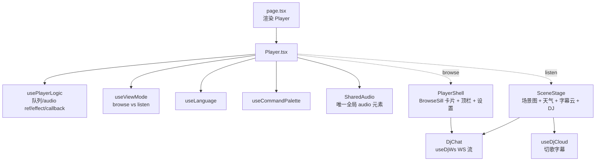

# 07 · apps/pwa

> Next.js 15 + React 19 + Tailwind 4 + manifest.json (PWA). 入口 `apps/pwa/app/page.tsx` 一行 `<Player />`.

## 顶层布局



## `<Player />` (`apps/pwa/app/components/player/Player.tsx`)

只做组装, 没业务逻辑. 关注点 (`Player.tsx:5-10`):

- audio 元素**全局唯一** — Browse / Listen 共用, 切 sill 不卸载 (否则 audio.src 丢, 歌停 + UI 卡播放中)
- `data-mode` 挂 `<html>` 上, 驱动 CSS 关窗动效 + 房间暗化
- 追踪 `previousSong` + `userInitiated` 给 DJ 用
- 顶栏: 设置 / cmdK 搜索

### View mode 切换

`useViewMode` 返 `{mode: 'browse'|'listen', enterListen, exitListen}`. Browse / Listen 是两套 React 树, 各自带房间场景图 + 天气. 切 mode 走整树 swap.

### `TrackMeta` (`Player.tsx:309-337`)

追踪 previousSong + userInitiated:

```ts
{
  ;(previousSong, userInitiated, markUserInitiated)
}
```

`markUserInitiated` 把 `pendingUserFlag.current = true`. 然后下一次 `currentSong` 变化时, useEffect 把 flag 落到 `userInitiated` state, 并清回 false. 默认自动续播判定.

DJ chat 派发 play → `playKeepView(song)` → `markUserInitiated()` + `playSong(song)`. DJ 字幕 use case 根据 `userInitiated` 切换语气 (主动点 vs 续播).

### `<SharedAudio />` (`Player.tsx:341-357`)

```tsx
<audio
  ref={logic.audioRef}
  crossOrigin="anonymous"
  onTimeUpdate={logic.actions.onTimeUpdate}
  onLoadedMetadata={logic.actions.onTimeUpdate}
  onPlay={logic.actions.onPlay}
  onPause={logic.actions.onPause}
  onEnded={logic.actions.handleEnded}
  preload="metadata"
/>
```

**`crossOrigin="anonymous"` 必须**: `useAudioAnalyser` 会调 `createMediaElementSource`, 跨域 audio 没 crossOrigin → Chrome 标 graph tainted → 整条输出静音 (audio.paused=false 还在播但听不到声). NCM CDN 已返回 `Access-Control-Allow-Origin: *`.

## `usePlayerLogic` (`apps/pwa/app/components/player/usePlayerLogic.ts`)

播放器全部状态机. Player.tsx 只 orchestration, 这里收敛所有逻辑.

### `PlayerState` (`player/types.ts:17`)

```ts
type PlayerState = {
  readonly queue: readonly ApiSong[]
  readonly currentIndex: number // -1 = 没在播
  readonly playing: boolean
  readonly currentTimeSec: number
  readonly durationSec: number
  readonly volume: number // 默认 0.04 (4%)
  readonly muted: boolean
  readonly mode: PlayMode // 'order'|'loop'|'single'|'shuffle'
  readonly lrcLines: readonly LrcLine[]
  readonly lrcLoading: boolean
  readonly audioUrl: string | undefined
  readonly audioLoading: boolean
  readonly error: string | undefined
}
```

### `PlayerActions` (`usePlayerLogic.ts:15-34`)

| Action                                | 做什么                                                               |
| ------------------------------------- | -------------------------------------------------------------------- |
| `playSong(song)`                      | `enqueueAndPlay`: 已在 queue 就 jump, 否则 append + set currentIndex |
| `queueSong(song)`                     | `appendUnique`: 已在 queue 不动, 否则 append                         |
| `insertNext(song)`                    | `insertAsNext`: 插当前曲后面                                         |
| `removeFromQueue(id)`                 | 维护 currentIndex 不指向错歌                                         |
| `moveInQueue(from, to)`               | 拖拽重排, 维持 currentIndex 指向同一首                               |
| `clearQueue()`                        | 当前播放留下, 其余清                                                 |
| `togglePlay()`                        | audio.play() / pause()                                               |
| `handlePrev` / `handleNext`           | `stepPrev` / `stepNext` 纯 transformer                               |
| `handleEnded()`                       | `mode==='single'` → audio.currentTime=0 + replay; 否则 `stepNext`    |
| `onSeek(sec)`                         | `audio.currentTime = sec`                                            |
| `setVolume(v)`                        | state.volume = v + audio.volume = v + muted=false                    |
| `toggleMute()`                        | muted ↔ audio.volume = 0 / 当前 volume                               |
| `cycleMode()`                         | order → loop → single → shuffle → order                              |
| `onTimeUpdate` / `onPlay` / `onPause` | `<audio>` 事件回调                                                   |

### `useTrackLoader` (`usePlayerLogic.ts:94-142`)

currentSong 变化时:

- 本地导入歌 (`localUrl !== undefined`) → 直接喂 blob URL, 跳 NCM fetch 和歌词
- 否则并行 `api.songUrl + api.lyric` → set `audioUrl + lrcLines`. 失败 → set `error`

`cancelled` flag 处理 race — 切歌途中再切要丢前一次的回包.

### `useAudioSourceSync` (`usePlayerLogic.ts:152-167`)

`audioUrl` 变化 → `audio.src = audioUrl; audio.play()`.

**deps 故意排除 volume/muted** — 它们由 setVolume/toggleMute 直接改 audio.volume, 进 deps 会"音量一动当前歌从头播"(用户痛点). 这里只在切歌瞬间读一次当前 volume.

### `usePersistState` (`usePlayerLogic.ts:87-92`)

queue / mode / volume / muted 变化时写 localStorage. 故意不 dep 整个 state — 每帧 `currentTime` tick 不该写盘.

### Pure transformers (`usePlayerLogic.ts:333-417`)

`enqueueAndPlay / appendUnique / insertAsNext / removeQueueItem / moveQueueItem / clearQueueKeepCurrent / stepNext / stepPrev / nextMode` 全是 `(state) => newState` 纯函数. 易测易推理. setState updater 直接调它们.

`handleEnded` 的 `single` 模式特别处理 (`usePlayerLogic.ts:231-246`): 副作用 (audio.play) **必须在 setState 外**, 否则 React StrictMode 会双播. 用 `queueMicrotask` schedule.

## `<DjChat />` (`apps/pwa/app/components/listen/DjChat.tsx`)

WS 流式 DJ 对话面板. 走 [[03 application 包]] 的 runDjTurn 全链路.

### 组件层次

```
DjChat (外层, 控制开关 + button trigger)
  ChatPanel (open=true 时挂载)
    useChatAction(onPlay, onNext) → handleAction
    useDjWs({enabled: open, onAction: handleAction}) → {state, sendUserMsg, cancel}
    buildContext(props) → DjContext (currentSong + queueLen)
    PanelLayout
      ChatHeader (标题 + 连接灯)
      ChatList (滚动消息列表)
      ChatForm (输入框 + 发送按钮, streaming 时变取消)
```

### `useChatAction` (`DjChat.tsx:240-251`)

返一个 stable 的 `(action: DjAction) => void` callback. 用 ref 持 args, 避免每次 render 都新建 onAction (否则 useDjWs 内部 effect 频繁 re-fire).

### `dispatchAction` (`DjChat.tsx:253-275`)

```ts
async function dispatchAction(action, handlers) {
  if (action.kind === 'next') {
    handlers.onNext()
    return
  }
  if (action.query === undefined || action.query.length === 0) return
  try {
    const res = await api.search(action.query, 1)
    const song = res.songs[0]
    if (song === undefined) {
      console.warn('[DjChat] dispatchAction: search returned 0 songs for', action.query)
      return
    }
    if (action.kind === 'play') handlers.onPlay(song)
    if (action.kind === 'queue') handlers.onPlay(song) // TODO(2026-06-08): 真 enqueue M3.1
  } catch (err) {
    console.error('[DjChat] dispatchAction: search failed for', action.query, err)
  }
}
```

DANGEROUS-1 fix (`DjChat.tsx:271-274`): search 失败必须留痕 — 否则 DJ 说了 "好的这就放" 但实际没放, 用户没任何反馈.

注: queue 当前临时也走 onPlay, M3.1 才接真 enqueue (需要把 `actions.queueSong` 传进来).

## `useDjWs` (`apps/pwa/app/lib/dj-ws-client.ts`)

浏览器侧 DJ WS 客户端. 与后端 `/api/dj/chat-ws` 一一对应.

### 设计要点 (`dj-ws-client.ts:5-11`)

- 单连接, 组件 mount 时 open, unmount 时 close
- 自动重连 (指数退避, 最多 `MAX_RECONNECT_ATTEMPTS = 8`, 起 `RECONNECT_BASE_MS = 500`)
- 心跳 ping 间隔 `PING_INTERVAL_MS = 25_000`
- 消息派发用 reducer 风格, UI 只读 state
- audio 事件 → enqueue 给 `SequentialAudioQueue`
- `sendUserMsg` 失败 (未连接) 返 false, UI 据此提示

### 返回 API

```ts
{
  state: { connected, messages: DjStreamingMessage[], streaming },
  sendUserMsg(text, context?): boolean,
  cancel(),
}
```

### `applyServerMsg` (`dj-ws-client.ts:191-222`)

```ts
switch (m.type) {
  case 'token':       state.messages = appendToken(messages, m.text)
  case 'action':      args.onAction({ kind, query? })
  case 'audio':       args.onAudio(m.url) (enqueue)
  case 'reply_done':  state = { streaming: false, messages: finalizeLastDj(messages, fullReply) }
  case 'error':       state = { streaming: false, messages: finalizeLastDj(messages, `[出错: ${msg}]`) }
  case 'turn_start' | 'sentence' | 'pong':  // 仅诊断, UI 不需要
}
```

**坏帧处理** (`dj-ws-client.ts:174-178`): JSON 坏或 schema 漂移 → 丢这帧 + `console.warn` 留痕. 否则 server 协议改了 dev/prod 都见不到.

### `SequentialAudioQueue` (`dj-ws-client.ts:259-318`)

一句一播, 不抢. queue idle → busy 转换时调 `duckMusic()`, busy → idle 调 `restoreMusic()`. 跨句子间隙不抖动 — 一段 DJ 多句串场, 第一句进队列 duck, 最后一句 onended 队列真空才 restore.

每个 audio 元素新建 `new Audio(url)`, `crossOrigin = 'anonymous'`, `onended`/`onerror` 都 `playNext()`. `audio.play().catch(playNext)` — autoplay 被拦时跳过这条, 后续仍尝试.

## `sharedAudioCtx` (`apps/pwa/app/components/player/sharedAudioCtx.ts`)

全局唯一 AudioContext + GainNode (音乐 ducking).

### 为什么必须共享 (`sharedAudioCtx.ts:3-13`)

`useAudioAnalyser` 会调 `createMediaElementSource(audio)`, 这一步**永久**把 audio 输出路由到这个 ctx graph. 如果 ctx 是 suspended → audio **没声音** (尽管 paused=false).

`ctx.resume()` 必须在用户 gesture 里调, 否则 Chrome 拒绝. 如果 unlock 用 ctx A、analyser 用 ctx B, analyser 的 ctx 永远没机会 resume → audio 永远静音.

所以: 同一个 ctx, unlock 时 resume, analyser 复用.

### `musicGainNode` 做 ducking (`sharedAudioCtx.ts:15-18`)

真实电台 DJ 说话时音乐自动压低 (~25%), 说完慢慢升回. 音乐流过 `musicGain → destination`, DJ 说话时滑到 `DUCK_LEVEL = 0.25`, 说完滑回 `1.0`. DJ TTS 不走 Web Audio (浏览器默认), 不受 musicGain 影响.

**用户定**: 视觉 (analyser) 不跟 DJ 跳, 所以 analyser 接 source **旁路**, 不进 destination. 这是 [[feedback_no_dj_in_visualizer]] memory 来的规则.

### ramp 控制 (`sharedAudioCtx.ts:82-93`)

```ts
node.gain.cancelScheduledValues(t) // 防之前 ramp 没跑完叠加
node.gain.setValueAtTime(node.gain.value, t) // 锚住"现在的值"
node.gain.linearRampToValueAtTime(target, t + RAMP_SEC)
```

不锚就 cancel 后从 ramp 起点接, 视觉/听觉会跳. `RAMP_SEC = 0.3` — 真电台经验值.

## `<SettingsPanel>` + `useNcmLogin` (`apps/pwa/app/components/settings/`)

扫码登录在设置面板里. 流程见 [[09 端到端 · 网易云扫码登录]].

`useNcmLogin` 是状态机:

```
idle → fetching → pending → scanned → success → idle (loggedIn=true)
                                    ↓
                                 expired (重新 startLogin)
                                    ↓
                                  error (网络挂)
```

轮询: 拿到 unikey 后每 2s 调 `api.loginQrCheck`, 直到 success / expired / unmount. `cancelled` flag + `pollRef` 处理 race + 清 timer.

## 场景图 (`apps/pwa/app/components/scene/` + `atmosphere/`)

视觉部分: `SceneStage` (listen 模式), `AtmosphereCanvas` 渲染雨/雪/晴粒子, `VinylRecord` (黑胶), `VizBars` (频谱).

跟 DJ chat 的关系: SceneStage 自带右下角 💬 触发器, 所以 `<DjChat hideTrigger={true} />` 不再渲染默认 button (`DjChat.tsx:37`).

详细视觉/动效不在架构笔记范围 — 用户可以单独拉一篇.

## 前端 api 层 (`apps/pwa/app/lib/api.ts`)

每个后端 endpoint 一个方法, 响应**全用 zod 校验**. 返 `z.infer` 类型.

`ApiSong` 在 `apiSongSchema` 推导基础上**额外加 `localUrl?: string`** — blob URL, 仅本地导入歌存在, 刷新即失效, 不入 zod 也不入 localStorage.

`get<T>` / `post<T>` helpers: fetch + `credentials: include` + schema 校验. POST 时**只在真有 body 才带 Content-Type**: Fastify 不允许 `application/json + 空 body` (FST_ERR_CTP_EMPTY_JSON_BODY → 400).

## 前端 env (`apps/pwa/app/lib/env.ts`)

```ts
const RAW = {
  serverUrl: process.env['NEXT_PUBLIC_SERVER_URL'] ?? 'http://127.0.0.1:8787',
} as const
export const env = envSchema.parse(RAW)
```

Next.js 公开 env 必须 `NEXT_PUBLIC_` 前缀, build 时内联. 业务代码不准散落 `process.env`.

返回 [[01 Clean Architecture 分层]]. 接下来看端到端流程: [[08 端到端 · DJ chat 流式对话]].
