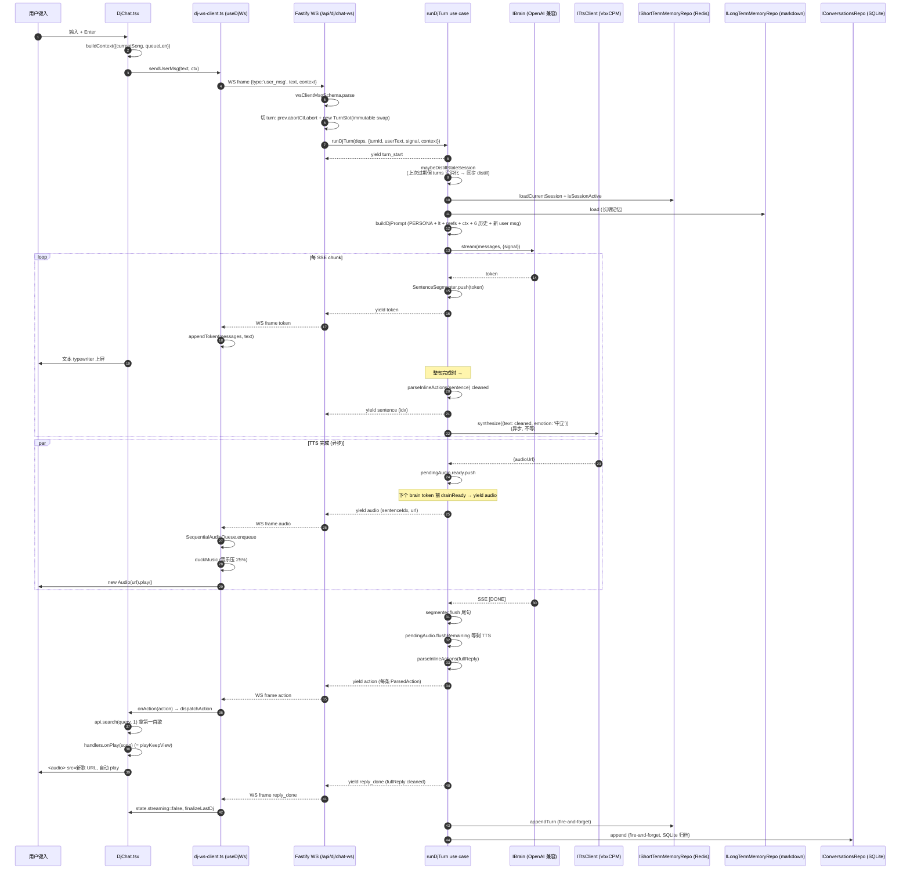

# 08 · 端到端 · DJ chat 流式对话

> 用户在 DjChat 输入框敲 "放点周杰伦, 顺便聊聊" 一直到 DJ 配音 + 切歌 + 文字流上屏 的完整链路.

## 总览 (mermaid)



## 关键节点详解

### 1. 浏览器端: DjChat 输入 (`apps/pwa/app/components/listen/DjChat.tsx`)

`PanelLayout` 的 `<form onSubmit>` → `submit()` (`DjChat.tsx:109-113`):

```ts
const submit = (): void => {
  const text = input.trim()
  if (text.length === 0 || p.streaming) return
  if (p.onSend(text)) setInput('')
}
```

`p.onSend = (text) => dj.sendUserMsg(text, ctx)`. `ctx` 是 `buildContext(props)` 出来的:

```ts
return {
  ...(currentSong && {
    currentSong: { id, title, artists: artists.map((a) => a.name).join(' / '), ncmId },
  }),
  ...(queueLen !== undefined && { queueLen }),
}
```

注: `artists` 拼成"周杰伦 / 蔡依林"字符串, 不是数组 — 跟 `DjContext` schema 的 `artists: z.string()` 对齐.

### 2. WS 客户端: `sendUserMsg` (`apps/pwa/app/lib/dj-ws-client.ts:77-84`)

```ts
const msg: WsClientMsg =
  context !== undefined ? { type: 'user_msg', text, context } : { type: 'user_msg', text }
const ok = sendRaw(wsRef.current, msg)
if (!ok) return false
setState((s) => appendUserAndPlaceholder(s, text))
return true
```

`appendUserAndPlaceholder` (`dj-ws-client.ts:95-105`) 在 messages 数组里 append:

- 用户消息 (streaming=false)
- DJ 占位 (streaming=true, text='') — token 来了就 append 到这个的 text

state.streaming = true, 让输入框 disable + 发送按钮变"取消".

### 3. WS 服务端: parse + 切 turn (`apps/server/src/api/dj-ws.ts`)

`socket.on('message', raw => { parseInbound + handleClientMsg })`. `wsClientMsgSchema.parse` 失败 → `send error frame, 不关连接`.

`handleClientMsg` 分:

- `ping` → `send pong`
- `cancel` → `current.abortCtl?.abort()`
- `user_msg` → 切 turn

切 turn (`dj-ws.ts:93-110`):

```ts
const prev = ctx.state.current
prev.abortCtl?.abort()
const newCtl = new AbortController()
const nextSeq = prev.turnSeq + 1
ctx.state.current = { abortCtl: newCtl, turnSeq: nextSeq } // immutable swap
const turnId = `t${nextSeq}-${clock.nowMs()}`
const timeoutId = setTimeout(() => newCtl.abort(), 90_000) // 兜底超时
try {
  await runTurnAndEmit(msg, turnId, newCtl.signal, ctx)
} finally {
  clearTimeout(timeoutId)
}
```

### 4. Use case: `runDjTurn` (`packages/application/src/use-cases/dj/run-dj-turn.ts`)

#### 4a. 进 turn 前 distill 旧 session

```ts
// run-dj-turn.ts:83
await maybeDistillStaleSession(deps)
```

`maybeDistillStaleSession` (`run-dj-turn.ts:148-167`):

1. `isSessionActive()` — active 还有 → return (继续, 不 distill)
2. `loadCurrentSession()` — 空 → return (没遗留)
3. **同步等** `distillSession(...)` — 让本轮 prompt 拿到刚 distill 的长期记忆

失败不阻塞 — log warn 下次再试.

#### 4b. 并行加载 prompt context

`loadAllMemory` (`run-dj-turn.ts:169-190`):

```ts
const [sessionTurns, prefs, longTerm] = await Promise.all([
  shortTerm.loadCurrentSession().catch(() => []),
  userPrefs.load(clock.nowMs()).catch(() => ({ longTerm: '', shortTerm: '' })),
  longTerm.load().catch(() => []),
])
```

任一失败用空默认 + log warn 留痕.

#### 4c. `buildDjPrompt` 装系统 prompt

见 [[03 application 包]] §`prompt.ts`. 顺序: PERSONA + 长期记忆 + prefs + ctx + 最近 6 历史 + user 当前.

`SESSION_HISTORY_LIMIT = 6` (`run-dj-turn.ts:193`). 旧的丢, 平衡 token 成本.

#### 4d. `streamBrainTokens` — 真交叉流式 (`run-dj-turn.ts:208-241`)

```ts
const segmenter = new SentenceSegmenter()
const pendingAudio = new PendingAudioQueue()

for await (const token of brain.stream(messages, { signal })) {
  if (signal.aborted) return
  // 关键: token 之前先 drain 已完成 audio, 实现 audio 跟 token 真交叉
  for (const ready of pendingAudio.drainReady()) yield ready
  yield { type: 'token', text: token }
  for (const sentence of segmenter.push(token)) {
    const { cleaned } = parseInlineActions(sentence)
    if (cleaned.length === 0) continue
    const idx = pendingAudio.allocate()
    yield { type: 'sentence', idx, text: cleaned }
    pendingAudio.startTts(deps, cleaned, idx)
  }
}
const tail = segmenter.flush()  // 流尾不完整句
if (tail.length > 0) { /* 同样处理 */ }
for await (const ev of pendingAudio.flushRemaining()) yield ev
```

#### 4e. `PendingAudioQueue` 详解 (`run-dj-turn.ts:247-296`)

每个待合成句分配一个 idx, 启动 TTS:

```ts
deps.tts
  .synthesize({ text, emotion: '中立' })
  .then((tts) => this.ready.push({ type: 'audio', sentenceIdx: idx, url: tts.audioUrl }))
  .catch((err) => log.warn(`tts failed for sentence ${idx}`, err))
  .finally(() => {
    inflightCount -= 1
    waiter?.()
  })
```

`drainReady()` 同步消费 `ready` 队列 — 每个 token 前调一次. 让"brain 还在吐 token, 已完成的句子已经能播了"成真.

`flushRemaining()` 边等边吐: 如果还有 inflight, 注册 waiter (Promise) 睡到下一个 settle.

旧实现 (architect audit 前) `drainReady` 是空 generator, 所有 audio 堆到 `flushRemaining` 一次性给, 流式 TTS 退化成串行批处理.

#### 4f. 流结束后 yield action + reply_done

```ts
// run-dj-turn.ts:115-118
const { cleaned, actions } = parseInlineActions(fullReply)
for (const action of actions) yield { type: 'action', action }
yield { type: 'reply_done', fullReply: cleaned }
persistTurn(deps, input, cleaned, startMs)
```

注意: action 是**最后一次性** yield 出去的, 不是按句 inline 派发. 这是有意识的选择 — 让 cleaned reply 是全文剥 tag 的版本, 跟 server 实际看到的一致.

(每句 inline 也调了 `parseInlineActions(sentence)` 但只取 cleaned, 不取 actions — 见 `run-dj-turn.ts:223-224`. 那是为了让 TTS 不念 tag, action 派发统一在最后.)

#### 4g. Persist (fire-and-forget)

`persistTurn` (`run-dj-turn.ts:122-144`):

```ts
void deps.shortTerm.appendTurn({ tsMs, userMsg, djReply: cleaned }).catch(warn)
void deps.conversations.append({ tsMs, userMsg, djReply: cleaned, brainLatencyMs }).catch(warn)
```

两路并行, 失败 log warn 不影响响应. `shortTerm` 入 Redis 作下轮 prompt context, `conversations` 入 SQLite 作长期归档.

### 5. WS 服务端: events → 帧

`runTurnAndEmit` (`apps/server/src/api/dj-ws.ts:113-146`):

```ts
const events = runDjTurn({ ...deps }, { ...input })
for await (const ev of events) send(ctx.socket, eventToFrame(ev))
```

`eventToFrame` 把 `DjTurnEvent` 翻译成 `WsServerMsg`. 一一对应.

`send` (`dj-ws.ts:169-176`) — readyState 检查 + try/catch 静默对端死.

### 6. WS 客户端: 接帧

`ws.onmessage` (`dj-ws-client.ts:169-180`):

```ts
const parsed = wsServerMsgSchema.parse(JSON.parse(evt.data))
applyServerMsg(parsed, args)
```

`applyServerMsg` switch 8 种 type, 见 [[07 apps-pwa]] §`useDjWs`.

token 累积到 last DJ 消息 text. audio enqueue `SequentialAudioQueue`. action 调 `args.onAction(...)`.

### 7. action 派发 → 切歌 (`apps/pwa/app/components/listen/DjChat.tsx:240-275`)

```ts
async function dispatchAction(action, handlers) {
  if (action.kind === 'next') return handlers.onNext()
  if (!action.query) return
  try {
    const res = await api.search(action.query, 1)
    if (!res.songs[0]) return console.warn(...)
    if (action.kind === 'play')  handlers.onPlay(song)
    if (action.kind === 'queue') handlers.onPlay(song)  // TODO M3.1 真 enqueue
  } catch (err) { console.error(...) }
}
```

`handlers.onPlay` 在 Listen 模式 = `playKeepView(song)` (Player.tsx:169-175):

```ts
trackMeta.markUserInitiated()
logic.actions.playSong(song)
```

`playSong` → `enqueueAndPlay` 在 queue 里 append + set currentIndex (`usePlayerLogic.ts:335-340`).

`currentIndex` 一变 → `currentSong` (memo) 变 → `useTrackLoader` 触发 → 并行 fetch `/api/song/{id}/url` + `/api/song/{id}/lyric` → set `audioUrl + lrcLines` → `useAudioSourceSync` 设 `audio.src` 并 `audio.play()`.

## 失败语义速查

| 失败                 | 当前行为                    | 用户感受                             |
| -------------------- | --------------------------- | ------------------------------------ |
| WS 断连              | 自动重连最多 8 次, 指数退避 | 连接灯闪, 短暂等待                   |
| user_msg JSON 坏     | server 发 error 帧不关连接  | chat 显 "[出错: ...]"                |
| brain 抛 / abort     | runDjTurn yield error 后停  | 同上                                 |
| 单句 TTS 失败        | log warn, 整轮不影响        | 那一句没配音, 其余正常               |
| `persistTurn` 失败   | log warn, fire-and-forget   | 无感, 下次 prompt 缺这条历史         |
| action search 失败   | `console.error`             | DJ 说了放歌但没动 (TODO M3.1: toast) |
| action search 0 结果 | `console.warn`              | 同上                                 |
| 服务端兜底超时 (90s) | newCtl.abort + log warn     | turn 半截结束                        |

## 重要约定

- **一次只跑一个 turn**: 新 user_msg 来了 abort 旧的, 永远只一个 `runDjTurn` generator 在跑 (`dj-ws.ts:93-99`)
- **immutable swap**: turn 状态切换不在原对象 mutate, 整 TurnSlot literal 替换 — 防 race
- **action 在 reply_done 前**: server 总是先 yield 所有 action 再 yield reply_done (`run-dj-turn.ts:116-117`). 前端 dispatch action 不依赖等 reply_done.

## 相关笔记

- [[03 application 包]] — runDjTurn 的 deps / event 类型 / SentenceSegmenter
- [[04 shared 包]] — WS 协议 schema + inline action 解析
- [[06 apps-server]] — `/api/dj/chat-ws` 路由细节
- [[07 apps-pwa]] — DjChat + useDjWs + SequentialAudioQueue + duck
- [[10 端到端 · 切歌字幕]] — 切歌后的字幕流程
