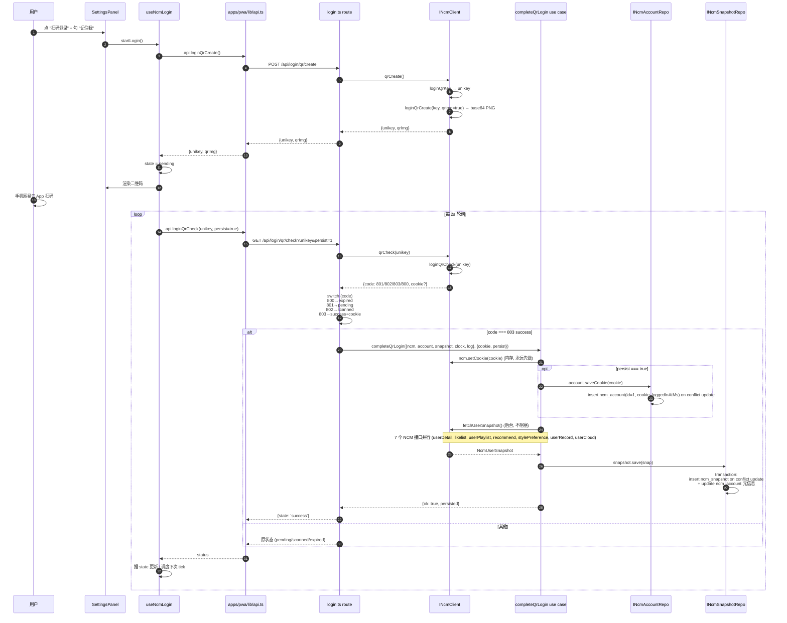
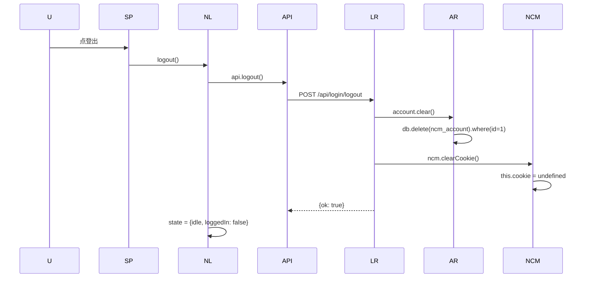

# 09 · 端到端 · 网易云扫码登录

> 从用户在设置面板点"扫码登录"到 cookie 入 DB + snapshot 拉好.

## 总览 (mermaid)



## 关键节点

### 1. `useNcmLogin` 状态机 (`apps/pwa/app/components/settings/useNcmLogin.ts`)

```ts
type LoginState =
  | { kind: 'idle'; loggedIn: boolean }
  | { kind: 'fetching' }
  | { kind: 'pending'; unikey; qrImg }
  | { kind: 'scanned'; unikey; qrImg }
  | { kind: 'success' }
  | { kind: 'expired' }
  | { kind: 'error'; message: string }
```

#### 初始 status check (`useNcmLogin.ts:82-101`)

mount 时 `api.loginStatus()` → `{loggedIn: bool}`. 失败 fallback 到"未登录" + console.warn — 退化合理 (登录态不可见胜过卡 UI), 但留痕便于区分"真没登录"vs"server 死了".

#### startLogin (`useNcmLogin.ts:110-121`)

1. stopPoll (清前一次的 timer)
2. `setState({kind: 'fetching'})`
3. `api.loginQrCreate()` → `{unikey, qrImg}`
4. `setState({kind: 'pending', unikey, qrImg})`
5. `schedulePoll(unikey, qrImg, ctx)` 起 2 秒轮询

#### schedulePoll (`useNcmLogin.ts:132-162`)

```ts
const tick = () => {
  api
    .loginQrCheck(unikey, ctx.rememberRef.current)
    .then((r) => {
      if (cancelled.current) return
      if (r.state === 'success') {
        setState({ kind: 'success' })
        // 1.5s 后回 idle 显示已登录
        setTimeout(() => setState({ kind: 'idle', loggedIn: true }), 1500)
        return // 不再 schedule 下次
      }
      if (r.state === 'expired') {
        setState({ kind: 'expired' })
        return
      }
      // pending / scanned → 继续轮询
      setState({ kind: r.state === 'scanned' ? 'scanned' : 'pending', unikey, qrImg })
      pollRef.current = setTimeout(tick, 2000)
    })
    .catch((err) => setState({ kind: 'error', message: err.message }))
}
pollRef.current = setTimeout(tick, 2000)
```

`rememberRef` 用 ref 不用闭包变量 — 这样 startLogin 时即使 remember 还没勾, 后面用户勾上, 轮询里读到的也是最新值.

`ctxRef` 走 ref 不每次 render 都新对象 — 否则 useEffect dep 永远变, cleanup 反复触发把 cancelled flip 来 flip 去, 把 inflight startLogin 杀掉 (`useNcmLogin.ts:60-62`).

### 2. `/api/login/qr/check` (`apps/server/src/api/login.ts:23-46`)

```ts
const { unikey, persist } = checkQuery.parse(req.query)
const status = await container.ncm.qrCheck(unikey)
if (status.state === 'success') {
  await completeQrLogin(
    { ncm, account, snapshot, clock, log: ucLog },
    { cookie: status.cookie, persist: persist === '1' },
  )
  return { state: 'success' as const }
}
return status // pending / scanned / expired 直返
```

注意: success 时**只返回 `{state: 'success'}` 不带 cookie** — cookie 在 server 内存 + 可选 DB, 不暴露给前端. 前端只需要知道"登好了".

### 3. `completeQrLogin` use case (`packages/application/src/use-cases/login/complete-qr-login.ts`)

```ts
// 1. 内存设 cookie 永远先做 (本次会话立即可用)
ncm.setCookie(input.cookie)

// 2. persist=true 才入 DB
let persisted = false
if (input.persist) {
  try {
    await account.saveCookie(cookie)
    persisted = true
  } catch (err) {
    log.warn('completeQrLogin: account.saveCookie failed (in-memory only)', err)
  }
}

// 3. 后台拉 snapshot, 不阻塞返回
void ncm
  .fetchUserSnapshot()
  .then((snap) => snapshot.save(snap))
  .catch((err) => log.warn('completeQrLogin: post-login snapshot fetch failed', err))

return { ok: true, persisted }
```

关键: snapshot 是 **fire-and-forget**. 用户体验是登录立即返回, snapshot 在后台拉. 失败用户可手动 `/api/snapshot/refresh` 重试.

### 4. `NcmClient.qrCreate` (`packages/infrastructure/src/ncm/index.ts:290-306`)

```ts
const keyBody = await callNcm(() => loginQrKey({}), qrKeyBodySchema, 'qrKey')
const unikey = keyBody.data?.unikey
if (unikey === undefined) throw new ExternalServiceError('NCM', 'qrKey returned no unikey')

const createBody = await callNcm(
  () => loginQrCreate({ key: unikey, qrimg: true }),
  qrCreateBodySchema,
  'qrCreate',
)
const qrImg = createBody.data?.qrimg
if (qrImg === undefined) throw new ExternalServiceError('NCM', 'qrCreate returned no qrimg')

return { unikey, qrImg }
```

两步: 先拿 unikey, 再拿 base64 PNG.

### 5. `NcmClient.qrCheck` + `interpretQrCheck` (`ncm/index.ts:308-385`)

```ts
async qrCheck(unikey): Promise<NcmLoginQrStatus> {
  const body = await callNcm(() => loginQrCheck({ key: unikey }), qrCheckBodySchema, 'qrCheck')
  return interpretQrCheck(body)
}

function interpretQrCheck(body): NcmLoginQrStatus {
  switch (body.code) {
    case 800: return { state: 'expired' }
    case 801: return { state: 'pending' }   // 等扫码
    case 802: return { state: 'scanned' }   // 已扫码, 等手机确认
    case 803:
      if (body.cookie === undefined) throw new ExternalServiceError('NCM', 'qrCheck 803 but no cookie')
      return { state: 'success', cookie: body.cookie }
    default: throw new ExternalServiceError('NCM', `qrCheck unknown code ${body.code}`)
  }
}
```

### 6. `INcmAccountRepo` 持久 (`packages/infrastructure/src/db/repos/account-repo.ts`)

```ts
saveCookie(cookie): {
  const nowMs = Date.now()  // 注意: 这里没走 IClock, 是 known gap
  db.insert(ncmAccount)
    .values({id: 1, cookie, loggedInAtMs: nowMs})
    .onConflictDoUpdate({target: ncmAccount.id, set: {cookie, loggedInAtMs: nowMs}})
    .run()
}
```

单行表 (`id=1` 固定). 单用户应用没多账号需求.

### 7. `fetchUserSnapshot` 并行 7 接口 (`ncm/index.ts:323-344`)

```ts
const [detail, like, play, rec, style, record, cloud] = await Promise.all([
  callNcm(() => userDetail({ uid: 0 }), userDetailBodySchema, 'userDetail'),
  callNcm(() => likelist({ uid: 0 }), likelistBodySchema, 'likelist'),
  callNcm(() => userPlaylist({ uid: 0, limit: 200 }), userPlaylistBodySchema, 'userPlaylist'),
  callNcm(() => recommendSongs({}), recommendBodySchema, 'recommendSongs'),
  callNcm(() => stylePreference({}), stylePrefBodySchema, 'stylePreference'),
  callNcm(() => userRecord({ uid: 0, type: 1 }), userRecordBodySchema, 'userRecord'),
  callNcm(() => userCloud({}), userCloudBodySchema, 'userCloud'),
])
```

`assembleSnapshot` 拼成 `NcmUserSnapshot`:

- `userId / userName / vipType / level` ← profile (detail)
- `likedSongIds` ← likelist + userCloud (取 union)
- `playlists` ← userPlaylist (自建 vs 收藏 用 `playlist[0].userId` 近似 self user id)
- `dailyRecommendations` ← recommend.dailySongs
- `stylePreferences` ← style.data.TAGS map(tagName)
- `recentPlayed` ← userRecord.weekData
- `snapshotAtMs` ← clock.nowMs()
- `heartMode: []` + `fmTrashSongIds: []` (留空, 这两个是占位字段)

### 8. `INcmSnapshotRepo.save` transaction (`db/repos/ncm-snapshot-repo.ts:63-95`)

```ts
db.transaction(tx => {
  tx.insert(ncmSnapshot).values({id: 1, snapshotAtMs, rawJson}).onConflictDoUpdate(...)
  // 同步更新 ncm_account 元信息
  tx.insert(ncmAccount).values({
    id: 1, userId, userName, vipType, level, lastSnapshotAtMs: snapshotAtMs,
  }).onConflictDoUpdate(...)
})
```

snapshot 和 account 元信息一致, 在同事务里写.

`rawJson` 存完整 `NcmUserSnapshot` 的 JSON 序列化. `load` 时 zod 校验 (`ncm-snapshot-repo.ts:16-58`).

## logout 流程



`ncm.clearCookie` (`ncm/index.ts:115-119`) 必须有 — 否则 logout 删了 DB 但内存里还在, 所有 `getCookie()` 守卫的接口 (playlists/mine, snapshot/refresh, ...) 在本进程内仍然"已登录".

## cold-start 时的 cookie 恢复

见 [[06 apps-server]] §`cold-start`. 启动时 `account.loadCookie` → 有则 `ncm.setCookie`. 同时如果 snapshot 超过 24h, 后台 refresh.

## 安全约束

- cookie 不进 logger (`cold-start.ts:11` 注释: "SECURITY: dbCookie 含 NCM 会话 token, **永远不要把它塞进 logger 调用**")
- logger redact paths 含 `cookie / authorization / token / password` (见 `packages/shared/src/logger/index.ts:8-17`)
- cookie 不暴露给前端 — `/api/login/qr/check` 返 success 时不带 cookie 字段
- `NCM_COOKIE` env 可选, 用户想 bypass 扫码 set 这个也行 (但 DB 优先级更高)

## 相关笔记

- [[06 apps-server]] — login route + cold-start
- [[05 infrastructure 包]] — NcmClient + AccountRepo + SnapshotRepo
- [[12 数据库 schema 与关键约定]] — `ncm_account` / `ncm_snapshot` 表结构
