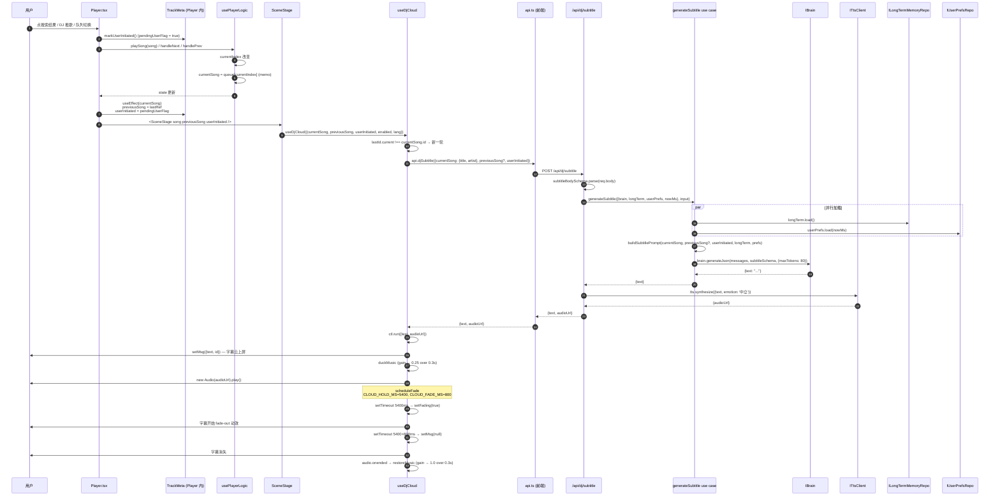

# 10 · 端到端 · 切歌字幕

> 用户点了首歌 (或自动续播), 屏幕中央弹一句 DJ 字幕云, 同时配音播报, 全程音乐压成 25%.

## 总览 (mermaid)



## 关键节点

### 1. TrackMeta — 上一首 + 谁切的 (`apps/pwa/app/components/player/Player.tsx:309-337`)

```ts
type TrackMeta = {
  readonly previousSong: ApiSong | undefined
  readonly userInitiated: boolean
  readonly markUserInitiated: () => void
}
```

实现:

- `pendingUserFlag.current = false` 默认
- 用户点歌按钮 / cmdK 选歌 / DJ chat 派发 / cycleMode 等都先调 `markUserInitiated()` 把 flag 置 true
- `useEffect([currentSong])`: 切歌时把 `lastSongRef.current` 落到 `previousSong` state, 然后 `userInitiated = pendingUserFlag.current`, 清回 false
- 自动续播 (`handleEnded` 触发) 不调 markUserInitiated → 默认 userInitiated=false

### 2. useDjCloud 触发条件 (`apps/pwa/app/components/listen/useDjState.ts:40-52`)

```ts
useEffect(() => {
  if (!props.enabled || !props.currentSong) {
    setMsg(null)
    return
  }
  if (lastId.current === props.currentSong.id) return // 同首歌不重发
  lastId.current = props.currentSong.id
  const { dispose } = startSubtitleFlow(props, setMsg, setFading)
  return dispose
}, [props.currentSong, props.previousSong, props.userInitiated, props.enabled, props.lang])
```

**deps 故意不传整 props** — props 每帧新对象, effect 每帧 re-fire, 字幕被反复清. 单字段已覆盖 effect 实际读的状态.

`enabled` 由 SceneStage 控制 — Listen 模式 + DJ 子模式才 true.

### 3. startSubtitleFlow (`useDjCloud.ts:59-78`)

```ts
const ctl = createFlowController(song.id, setMsg, setFading)
void fetchSubtitle(props)
  .then((result) => ctl.run(result ?? { text: localFallback(props), audioUrl: null }))
  .catch((err) => {
    console.warn('[DJ subtitle] fetch failed, using local template:', err)
    ctl.run({ text: localFallback(props), audioUrl: null })
  })
return { dispose: ctl.dispose }
```

`fetchSubtitle` 返 null 时 (brain text=null) → fallback 本地模板. `catch` 同处理.

### 4. FlowController 时序 (`useDjCloud.ts:86-126`)

```ts
state = { cancelled: false, t1: 0, t2: 0, audio: null }
run(result) {
  setMsg({text, id: `${songId}-${Date.now()}`})
  setFading(false)
  state.audio = playAudioWithDuck(audioUrl, duckCtl)
  scheduleFade()  // t1 → setFading(true), t2 → setMsg(null) + setFading(false)
}
dispose() {
  state.cancelled = true
  clearTimeout(t1); clearTimeout(t2)
  state.audio?.pause(); state.audio.src = ''
  duckCtl.endIfNeeded()
}
```

`CLOUD_HOLD_MS = 5400` (5.4 秒), `CLOUD_FADE_MS = 800` (0.8 秒 fade). 即使 audio 短文本也保留 ≥ 5.4 秒, 让人看清.

id 用 `${songId}-${Date.now()}` 拼 — React 用作 key, 同首歌触发新一轮字幕时强制 remount 让 fade-in 重跑. 这里 `Date.now` 是合理的 UI-key 用途, 不是业务时间.

### 5. playAudioWithDuck (`useDjCloud.ts:146-165`)

```ts
if (!audioUrl) return null
duckCtl.start() // duckMusic() gain → 0.25
const audio = new Audio(audioUrl)
audio.crossOrigin = 'anonymous'
audio.onended = () => duckCtl.endIfNeeded() // restoreMusic
audio.onerror = () => duckCtl.endIfNeeded()
void audio.play().catch(() => duckCtl.endIfNeeded()) // autoplay 被拦也要还原
return audio
```

每一句字幕一个独立 `Audio` 元素 — 比 DJ chat 的 `SequentialAudioQueue` 简单, 切歌一次只一句.

### 6. 后端 use case `generateSubtitle` (`packages/application/src/use-cases/dj/generate-subtitle.ts`)

```ts
const [longTerm, prefs] = await Promise.all([
  longTerm.load().catch(() => []),
  userPrefs.load(nowMs).catch(() => ({ longTerm: '', shortTerm: '' })),
])

const messages = buildSubtitlePrompt({
  currentSong,
  userInitiated,
  longTerm,
  prefs,
  ...(previousSong && { previousSong }),
})

try {
  const parsed = await brain.generateJson(messages, subtitleSchema, { maxTokens: 80 })
  return { text: parsed.text.trim() }
} catch (err) {
  log.warn('generateSubtitle: brain.generateJson failed', err)
  return { text: null }
}
```

`subtitleSchema = z.object({ text: z.string().min(1).max(60) })`.

失败返 `{text: null}`, 调用方知道 brain 挂了.

### 7. `buildSubtitlePrompt` (`packages/application/src/dj/prompt.ts:130-149`)

System (`SUBTITLE_SYSTEM`, `prompt.ts:102-115`) 强调:

- 中文, 1 句 ≤ 30 字
- 深夜电台口吻: 温柔 + 神秘感, 别太热情
- 称"你"
- 用喜好/记忆个性化 (不照搬不列点不点时间日期)
- userInitiated=true: "好" / "点的是..." 这种承接感
- userInitiated=false: "下面这首..." / "送你一首..." 串场感
- 上一首和当前都有时, 可以承接气氛
- 输出格式: 纯中文文字; 不带 emoji / 控制标签 / 列点 / 英文 (除歌名艺人)
- 输出 JSON: `{"text": "..."}`

User 消息拼 (`prompt.ts:130-148`):

```
[长期记忆段, 有则]

[prefs 段, 有则]

# 这次场景
当前歌: ${title} · ${artist}
刚刚那首: ${prevTitle} · ${prevArtist}    (或 "刚开始, 没有上一首")
谁切的: ${userInitiated ? '听众主动点的' : '自动续播'}
```

### 8. 路由层 `/api/dj/subtitle` (`apps/server/src/api/dj-subtitle.ts`)

```ts
const result = await generateSubtitle(
  { brain, longTerm, userPrefs, nowMs: clock.nowMs(), log },
  input,
)

let audioUrl: string | null = null
if (result.text !== null) {
  try {
    const tts = await container.tts.synthesize({ text: result.text, emotion: '中立' })
    audioUrl = tts.audioUrl
  } catch (err) {
    req.log.warn({ err, text: result.text }, 'subtitle TTS synthesize failed')
  }
}

return { text: result.text, audioUrl }
```

容错: brain 返 null 时跳过 TTS; TTS 失败时 audioUrl=null 文本还能展示.

### 9. 本地 fallback 模板 (`useDjCloud.ts:208-264`)

brain 挂了 UI 不能空 — 退回本地抽签模板:

```ts
const ZH_INTROS_USER = ['好,放你的{title} · {artist}', '点的是{artist}的{title},来', ...]
const ZH_INTROS_AUTO = ['接下来给你放{artist}的{title}', '雨天合适听这首—{title} · {artist}', ...]
const ZH_TRANSITIONS = ['听完{prevTitle},接{title}', ...]
const EN_INTROS_USER = ['Alright, your pick: {title} by {artist}', ...]
const EN_INTROS_AUTO = ['Next up, {title} by {artist}', ...]
const EN_TRANSITIONS = ['After {prevTitle}, here is {title}', ...]
```

`pickPool(lang, hasPrev, userInitiated)` 选池. `Math.random` 抽签. 模板 `{title} {artist} {prevTitle} {prevArtist}` 用 `replaceAll`.

模板抽签**不可确定** — 但只在 brain 挂时才用, 业务可接受不一致.

## ducking 怎么跟 chat 的 ducking 协作

两个独立 duck controller 走同一个 `musicGainNode`:

- DjChat 的 `SequentialAudioQueue` 一段说完 (队列空) 才 restore
- useDjCloud 的 `createDuckController` 一句完 (onended) 就 restore

两者**不互相协调**. 同时跑时谁后面 ramp 谁说了算. `cancelScheduledValues + setValueAtTime` 锚住"现在的值"防跳变 (`sharedAudioCtx.ts:88-92`).

实际场景里两者通常不并发 (DJ chat 弹板时一般不主动切歌; 切歌触发字幕时一般不开 chat). 但即使并发也只会"音乐被一直压着", 听感无明显问题.

## 失败语义速查

| 失败                                | 行为                               | 用户感受         |
| ----------------------------------- | ---------------------------------- | ---------------- |
| `/api/dj/subtitle` 网络挂 / 500     | `console.warn` + 本地模板          | 字幕仍有, 没配音 |
| brain.generateJson 抛               | `{text: null}` → 前端本地模板      | 同上             |
| brain 返 text but tts 失败          | server 返 `{text, audioUrl: null}` | 字幕在, 没声     |
| autoplay 被拦 (Chrome 自动播放策略) | `duckCtl.endIfNeeded()` 还原音乐   | 字幕在, 没 DJ 声 |
| 字幕音频 onerror                    | 同 onended                         | 同上             |

## 重要约定

- **一首歌一次字幕**: `lastId.current === currentSong.id` 时不重发 (`useDjCloud.ts:45`). 即使 effect 触发也无操作
- **每次新字幕 remount**: `setMsg({text, id: songId-Date.now()})` 强制 key 变, React unmount + remount fade-in 重跑
- **deps dispose 时立即 cancel**: 切歌中途再切, 前一次的 setTimeout 全 clear, audio 停 + clear src, duck 立刻还原

## 相关笔记

- [[03 application 包]] — generateSubtitle use case + buildSubtitlePrompt
- [[06 apps-server]] — `/api/dj/subtitle` 路由
- [[07 apps-pwa]] — useDjCloud + sharedAudioCtx ducking
- [[08 端到端 · DJ chat 流式对话]] — DJ chat 配音的 ducking 路径
