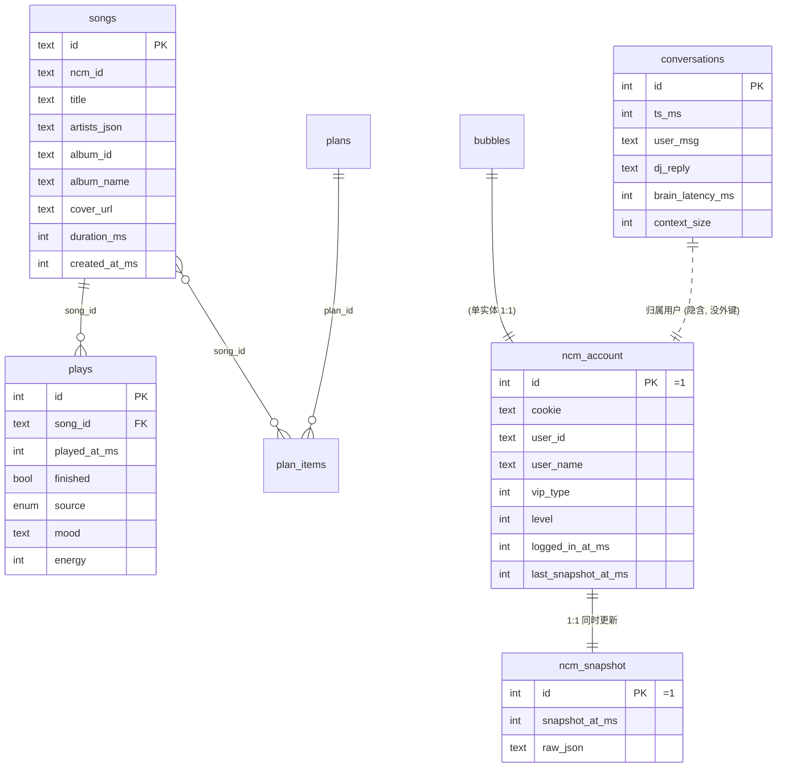

# 12 · 数据库 schema 与关键约定

> SQLite + drizzle. 唯一真相源: `packages/infrastructure/src/db/schema.ts`. 类型 `typeof xxx.$inferSelect` 自动推导, 不手写.

## 表速查

| 表名              | 主键          | 用途                       | 谁在写                                                                     | 谁在读                                                        |
| ----------------- | ------------- | -------------------------- | -------------------------------------------------------------------------- | ------------------------------------------------------------- |
| `songs`           | id (= ncmId)  | NCM 歌曲元数据缓存         | `createSongRepo.upsert`                                                    | `createSongRepo.findById`, `/api/plays/recent` join           |
| `plays`           | autoincrement | 听歌历史                   | `createPlaysRepo.recordPlay`                                               | `/api/plays/recent`, `countPlays`                             |
| `bubbles`         | id            | DJ 串场记录                | **暂无 writer** (留作 M3+)                                                 | —                                                             |
| `plans`           | id            | 今日节目单                 | **暂无 writer**                                                            | —                                                             |
| `plan_items`      | autoincrement | 节目单条目                 | **暂无 writer**                                                            | —                                                             |
| `prefs`           | key           | k/v JSON 配置              | **暂无 writer**                                                            | —                                                             |
| `taste_snapshots` | autoincrement | taste.md 演进快照          | **暂无 writer**                                                            | —                                                             |
| `conversations`   | autoincrement | DJ 对话历史归档            | `runDjTurn.persistTurn` (fire-and-forget)                                  | **目前只 append, 不查** (prompt 走 Redis short-term)          |
| `ncm_account`     | id=1 单行     | 网易云账号 cookie + 元信息 | `completeQrLogin` → `account.saveCookie`; `snapshot.save` 同事务更新元信息 | `cold-start` → `account.loadCookie`, ncm_snapshot.save 同事务 |
| `ncm_snapshot`    | id=1 单行     | 用户画像快照               | `refreshUserSnapshot` / `completeQrLogin` 后台 / `cold-start`              | `/api/snapshot/current`, `/api/snapshot/status`               |

**关键约定**: 4 张表 (`bubbles / plans / plan_items / prefs / taste_snapshots`) 当前没人写, schema 留作 M3+ 扩展. 看到这些表为空不是 bug.

## `songs` (NCM 元数据缓存)

```ts
sqliteTable('songs', {
  id: text('id').primaryKey(), // = ncmId, branded SongId
  ncmId: text('ncm_id').notNull(),
  title: text('title').notNull(),
  artistsJson: text('artists_json').notNull(), // JSON: [{id, name}]
  albumId: text('album_id'), // 可空
  albumName: text('album_name'),
  coverUrl: text('cover_url'),
  durationMs: integer('duration_ms').notNull(),
  createdAtMs: integer('created_at_ms')
    .notNull()
    .default(sql`(unixepoch() * 1000)`),
})
```

- `artists` 列存 JSON 字符串. `parseArtists` 用 zod 校验反序列化 (`db/repos/song-repo.ts:14-29`). 坏 JSON → 抛 `ValidationError` (Standards §6 — DB 也是 untrusted boundary)
- `id` 跟 `ncmId` 在当前实现都是相同的数字字符串. 概念上分开 (id 是 branded SongId 给内部用, ncmId 留作 NCM API 回调)
- `createdAtMs` 用 SQLite 内置 `unixepoch() * 1000` 作默认 — drizzle migration 生成的

## `plays` (听歌历史)

```ts
sqliteTable('plays', {
  id: integer('id').primaryKey({ autoIncrement: true }),
  songId: text('song_id').notNull(),
  playedAtMs: integer('played_at_ms').notNull(),
  finished: integer('finished', { mode: 'boolean' }).notNull(),
  source: text('source', { enum: ['plan', 'fm', 'manual', 'recommendation', 'search'] }).notNull(),
  mood: text('mood'), // 可空, 当前没写
  energy: integer('energy'), // 可空, 当前没写
})
```

POST `/api/plays` 写入 (`apps/server/src/api/plays.ts:21-30`). `recentPlays` 用 join songs 表拿 title/artist 显示, 不 N+1 (`api/plays.ts:35-54`).

`mood / energy` 留作未来 mood-aware 选歌, 当前 writer 不填.

## `conversations` (DJ 对话归档)

```ts
sqliteTable('conversations', {
  id: integer('id').primaryKey({ autoIncrement: true }),
  tsMs: integer('ts_ms').notNull(),
  userMsg: text('user_msg').notNull(),
  djReply: text('dj_reply').notNull(),
  brainLatencyMs: integer('brain_latency_ms'),
  contextSize: integer('context_size'), // 留空, 当前不算
})
```

**关键变化**: 之前是 DJ chat prompt context 的来源, 现在 prompt context 走 Redis `shortTerm`. 这表只剩**长期归档 + 分析用途** ([[03 application 包]] §`run-dj-turn.ts`).

`runDjTurn.persistTurn` (`packages/application/src/use-cases/dj/run-dj-turn.ts:122-144`) 把 `cleaned reply` (action tag 剥掉的版本) 写进来. fire-and-forget, 失败 log warn 不阻塞.

## `ncm_account` (单行)

```ts
sqliteTable('ncm_account', {
  id: integer('id').primaryKey().default(1), // 永远 = 1
  cookie: text('cookie'),
  userId: text('user_id'),
  userName: text('user_name'),
  vipType: integer('vip_type').notNull().default(0),
  level: integer('level').notNull().default(0),
  loggedInAtMs: integer('logged_in_at_ms'),
  lastSnapshotAtMs: integer('last_snapshot_at_ms'),
})
```

单用户应用 — `id=1` 固定. cookie + 用户元信息.

- `account.saveCookie` 写 cookie + loggedInAtMs (`db/repos/account-repo.ts:14-25`)
- `snapshot.save` 同事务更新 userId / userName / vipType / level / lastSnapshotAtMs (`db/repos/ncm-snapshot-repo.ts:74-95`)
- `account.clear` 删整行 (logout) (`account-repo.ts:32-34`)

## `ncm_snapshot` (单行)

```ts
sqliteTable('ncm_snapshot', {
  id: integer('id').primaryKey().default(1), // 永远 = 1
  snapshotAtMs: integer('snapshot_at_ms').notNull(),
  rawJson: text('raw_json').notNull(), // 完整 NcmUserSnapshot 的 JSON 序列化
})
```

`save` 时 transaction 同步 `ncm_snapshot` + `ncm_account` 元信息 (`ncm-snapshot-repo.ts:64-95`).

`load` 时反序列化 + zod 校验顶层 + 关键嵌套 (`ncm-snapshot-repo.ts:16-58`). 坏 JSON → 抛 `ValidationError`.

注: TODO(2026-05-26) — 把 `NcmUserSnapshot` 在 application 层改为 zod 单一真相源后, 能 z.infer 出完整类型, 去掉 zod 简化版校验.

## 未启用的 4 张表 (M3+ 留空)

### `bubbles`

DJ 串场记录, 跟 domain `Bubble` 对应. 当前 DJ 对话走 `conversations` + `shortTerm`, 不写 bubbles. 留作未来"显式的 DJ 出声历史回放"功能用.

### `plans` + `plan_items`

每日节目单. 当前 DJ 是"实时反应式"挑歌, 没"早上生成节目单"那条流程. 留给未来定时任务用.

`plan_items.status` 是 `'queued' | 'playing' | 'played' | 'skipped'` enum, `orderIdx` 维护排序.

### `prefs`

k/v JSON 配置, 通用占位. 当前 prefs 走文件 (`apps/server/data/user-prefs/`) 不写表. 留给"应用内编辑的配置"用.

### `taste_snapshots`

taste.md 演进快照. 当前 taste 也走文件, 不写表. 留给"taste 改动历史 timeline"功能用.

## drizzle 配置 + migrations

### `drizzle.config.ts` (`packages/infrastructure/drizzle.config.ts`)

让 drizzle-kit 知道在哪生成 / 哪应用 migrations.

### Migrations 目录

Infra bundled (`createDb` 自带, `db/client.ts:22-23`):

```ts
const HERE = dirname(fileURLToPath(import.meta.url))
const BUNDLED_MIGRATIONS_DIR = resolve(HERE, 'migrations')
```

也就是 `packages/infrastructure/src/db/migrations/`. 用户改 schema 后跑 `drizzle-kit generate` 生成新 SQL, drizzle 启动时 apply 没跑过的.

Prod build 时这相对路径会跑偏 (dist 下结构变), 用 env `MIGRATIONS_DIR` 覆盖 (`composition.ts:73`).

## 重要约束总结

### 1. 单用户单行表

`ncm_account.id=1` / `ncm_snapshot.id=1` — 永远只一行. 加新用户不是这一版的需求, 别加 user_id 列.

### 2. 边界 zod 校验

DB JSON 列读出来必须 zod 校验后再用. `songs.artists_json` + `ncm_snapshot.raw_json` 都这样做. 坏 JSON 抛 `ValidationError` 不静默吞.

### 3. 单一事务

ncm_snapshot 和 ncm_account 元信息一致, 在同 `db.transaction(tx => {...})` 里写 (`ncm-snapshot-repo.ts:65-95`). 否则两路径不一致.

### 4. better-sqlite3 是同步 API

drizzle 用 `select / insert / update / delete` 是同步. 但 application port 是 async 接口 — repo 实现里用 `/* eslint-disable @typescript-eslint/require-await */` 处理.

### 5. WAL 模式

`createDb` 里 `sqlite.pragma('journal_mode = WAL')` (`db/client.ts:38`). 让 SQLite 读写并发更好 (虽然单进程不一定能感受到差异).

### 6. branded id 串台防御

DB 反序列化时:

- 主键 `id` 用 `toSongId(row.id)` (`db/repos/song-repo.ts:38`)
- 外键引用 (artists 数组) 用 `toArtistId(a.id)` (同文件:33)
- 等等

这样内部代码全用 branded type, 不会把 ArtistId 当 SongId 传错.

## 完整 ER 示意



> 注: 实际 schema 里没 foreign key 约束 (没显式 `references()` 声明). 是 logical relation 不是物理外键. PRAGMA `foreign_keys = ON` 开了但没人声明 reference.

## 相关笔记

- [[05 infrastructure 包]] — repo 工厂 + DB 客户端细节
- [[09 端到端 · 网易云扫码登录]] — ncm_account / ncm_snapshot 写入路径
- [[08 端到端 · DJ chat 流式对话]] — conversations 写入路径
